<div align="center">

<a href="https://experlik.ma" target="_blank" rel="noopener noreferrer">
  
</a>

# Calendly Clone

**Plateforme complete de reservation en ligne** - developpee dans le cadre d un **stage d initiation** chez **Xperlik**

<a href="https://calendlyclone-chi.vercel.app" target="_blank" rel="noopener noreferrer">
  
</a>
<a href="https://calendlyclone-high.vercel.app" target="_blank" rel="noopener noreferrer">
  
</a>

</div>

---

## Acces Admin

| Champ | Valeur |
|---|---|
| **URL** | [calendlyclone-high.vercel.app](https://calendlyclone-high.vercel.app) |
| **Email** | `Experlik@gmail.com` |
| **Mot de passe** | `admin2025` |

<div align="center">


</div>

---

## 

- [Vue d ensemble](#vue-densemble)
- [Fonctionnalites](#fonctionnalites)
- [Stack Technologique](#stack-technologique)
- [Architecture du Systeme](#architecture-du-systeme)
- [Architecture de Deploiement](#architecture-de-deploiement)
- [Flux de Donnees](#flux-de-donnees)
- [Modeles de Donnees](#modeles-de-donnees)
- [Cas d Utilisation](#cas-dutilisation)
- [API REST Endpoints](#api-rest-endpoints)
- [Diagrammes de Sequence](#diagrammes-de-sequence)
- [Flux de Paiement Multi-Gateway](#flux-de-paiement-multi-gateway)
- [Diagrammes UML Supplementaires](#diagrammes-uml-supplementaires)
- [Structure du Projet](#structure-du-projet)
- [Installation et Lancement](#installation-et-lancement)

---

## Vue d ensemble

**CalendlyClone** (rebaptise **Xperlik**) est une plateforme de reservation en ligne full-stack, inspiree de Calendly, developpee en **2025** lors d un stage d initiation. Elle permet a des prestataires de services de gerer leurs plannings, creneaux, evenements et codes promo, tandis que les utilisateurs peuvent reserver des rendez-vous, s inscrire a des evenements et effectuer des paiements en ligne via plusieurs passerelles.

Le projet est structure en **trois applications distinctes** deployees independamment sur **Vercel** :

| Application | Role | URL |
|---|---|---|
| Frontend Utilisateur | Interface client — reservations, profil, evenements | [calendlyclone-chi.vercel.app](https://calendlyclone-chi.vercel.app) |
| Frontend Admin / Prestataire | Tableau de bord admin + interface prestataire | [calendlyclone-high.vercel.app](https://calendlyclone-high.vercel.app) |
| Backend API | API REST Node.js/Express | [calendlyclone-back.vercel.app](https://calendlyclone-back.vercel.app) |

---

## Fonctionnalites

### Cote Utilisateur
- **Inscription et Connexion** avec verification par OTP email
- **Exploration des prestataires** par specialite
- **Reservation de rendez-vous** avec selection de creneaux en temps reel
- **Reservation via Calendrier** — creneaux generes dynamiquement par le prestataire
- **Inscription aux evenements** — evenements gratuits ou payants
- **Paiement en ligne** — Stripe, Razorpay, Payzone
- **Codes promotionnels** — reduction fixe ou en pourcentage
- **Gestion du profil** — photo, adresse, informations personnelles
- **Suivi des reservations** — statut en temps reel, annulation
- **Historique des evenements** inscrits

### Cote Prestataire (Abonne)
- **Connexion dediee** a l espace prestataire
- **Gestion des rendez-vous** — confirmer, completer, annuler
- **Configuration du calendrier** — jours ouvres, horaires, pauses
- **Generation automatique de creneaux** selon la configuration
- **Creation et gestion d evenements** — titre, date, lieu, capacite, prix
- **Generation de codes promo** — duree, limite d usage, type de remise
- **Statistiques** — revenus, taux d occupation, nombre de reservations

### Cote Administrateur
- **Tableau de bord global** — statistiques et revenus
- **Ajout / Suppression de prestataires** avec image Cloudinary
- **Gestion de tous les rendez-vous** du systeme
- **Acces complet** a la liste des prestataires

---

## Stack Technologique

<div align="center">

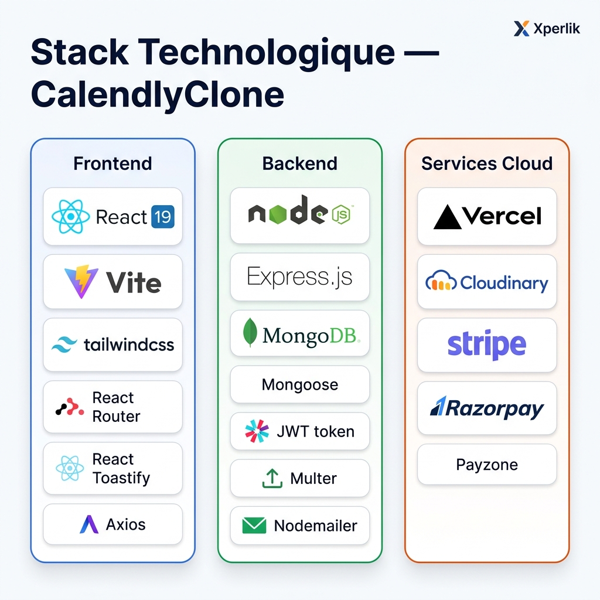

</div>

### Frontend (React)

| Technologie | Version | Usage |
|---|---|---|
| **React** | 19.x | Framework UI principal |
| **Vite** | 7.x | Bundler et Dev Server |
| **React Router DOM** | 7.x | Navigation SPA |
| **Tailwind CSS** | 3.x | Styles utilitaires |
| **Axios** | 1.x | Requetes HTTP |
| **React Toastify** | 11.x | Notifications |
| **React Phone Input** | 3.x | Saisie numero international |

### Backend (Node.js)

| Technologie | Version | Usage |
|---|---|---|
| **Node.js + Express** | 5.x | Serveur API REST |
| **MongoDB + Mongoose** | 8.x | Base de donnees NoSQL |
| **JWT** | 9.x | Authentification stateless |
| **Bcrypt** | 6.x | Hashage des mots de passe |
| **Multer** | 2.x | Upload de fichiers |
| **Nodemailer** | 7.x | Envoi d emails (OTP) |
| **Cloudinary** | 2.x | Stockage d images cloud |
| **Stripe** | 18.x | Passerelle de paiement |
| **Razorpay** | 2.x | Passerelle de paiement |

### Infrastructure et Deploiement

| Service | Usage |
|---|---|
| **Vercel** | Hebergement des 3 applications |
| **MongoDB Atlas** | Base de donnees cloud |
| **Cloudinary CDN** | Stockage et optimisation des images |

---

## Architecture du Systeme

<div align="center">

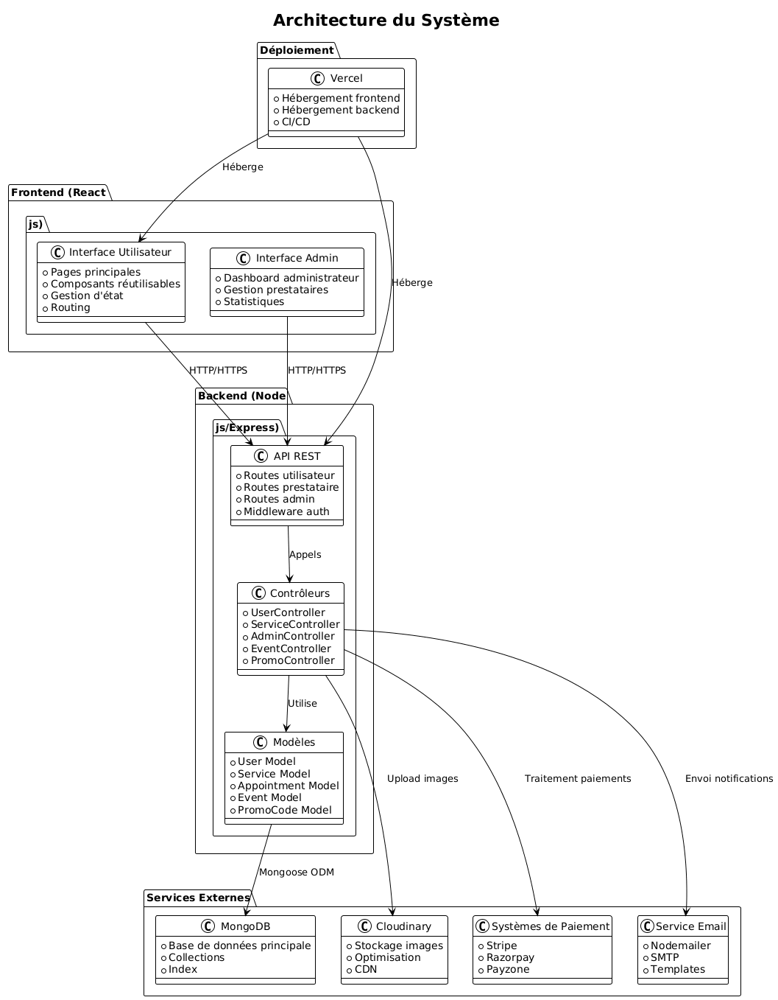

</div>

L architecture suit le modele **3-tiers classique** :

```
+----------------------------------------------------------+
|                    VERCEL CDN/Edge                        |
|  +------------------+  +------------------------------+  |
|  |  Frontend User   |  |      Frontend Admin          |  |
|  |  React + Vite    |  |  React + Vite (Admin Panel)  |  |
|  +--------+---------+  +--------------+---------------+  |
+-----------|---------------------------|--------------------|
            | HTTP/HTTPS               | HTTP/HTTPS
            v                          v
+----------------------------------------------------------+
|               Backend API — Node.js/Express              |
|  +------------------------------------------------------+|
|  |  Middlewares : authUser | authService | multer       ||
|  |----------------------------------------------------- ||
|  |  Routes : /user | /service | /admin                  ||
|  |           /event | /calendar | /promo                ||
|  |------------------------------------------------------||
|  |  Controllers : UserCtrl | ServiceCtrl | AdminCtrl    ||
|  |               EventCtrl | CalendarCtrl | PromoCtrl   ||
|  +------------------------------------------------------+|
+----------------------------------------------------------+
            | Mongoose ODM
            v
+----------------------------------------------------------+
|                   Services Externes                       |
|  MongoDB Atlas | Cloudinary | Stripe | Razorpay | SMTP  |
+----------------------------------------------------------+
```

---

## Architecture de Deploiement

<div align="center">

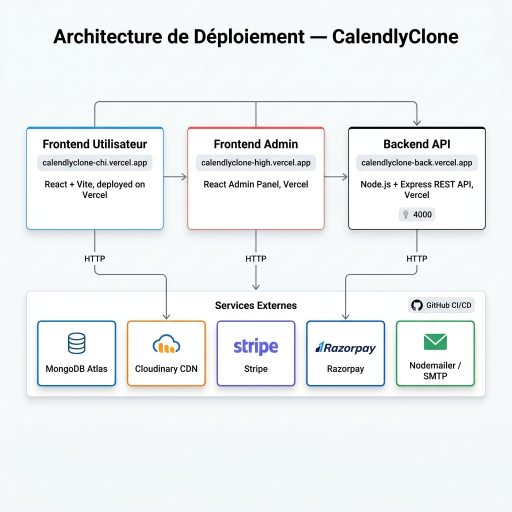

</div>

Les trois applications sont deployees de maniere independante sur **Vercel** :

```
GitHub Repository
    |
    +-- /frontend  ---- Vercel --> calendlyclone-chi.vercel.app
    +-- /admin     ---- Vercel --> calendlyclone-high.vercel.app
    +-- /backend   ---- Vercel --> calendlyclone-back.vercel.app
                                    |
                           +--------v--------+
                           |  Services Cloud  |
                           |  MongoDB Atlas   |
                           |  Cloudinary CDN  |
                           |  Stripe API      |
                           |  Razorpay API    |
                           |  Nodemailer/SMTP |
                           +-----------------+
```

---

## Flux de Donnees

<div align="center">

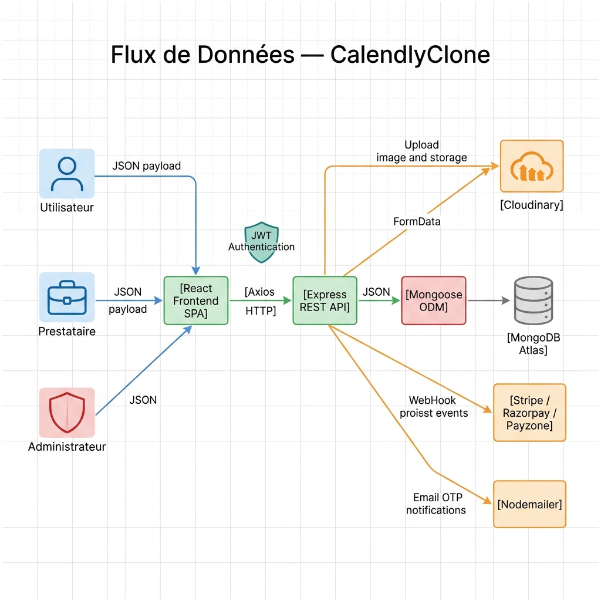

</div>

Chaque requete client suit le flux suivant :

1. **Client React** envoie une requete HTTP via **Axios**
2. Le **Middleware JWT** valide le token d authentification
3. Le **Controleur** approprie traite la logique metier
4. Le **Modele Mongoose** interagit avec **MongoDB Atlas**
5. Les services externes (Cloudinary, Stripe...) sont appeles si besoin
6. La **reponse JSON** est retournee au client

---

## Modeles de Donnees

<div align="center">

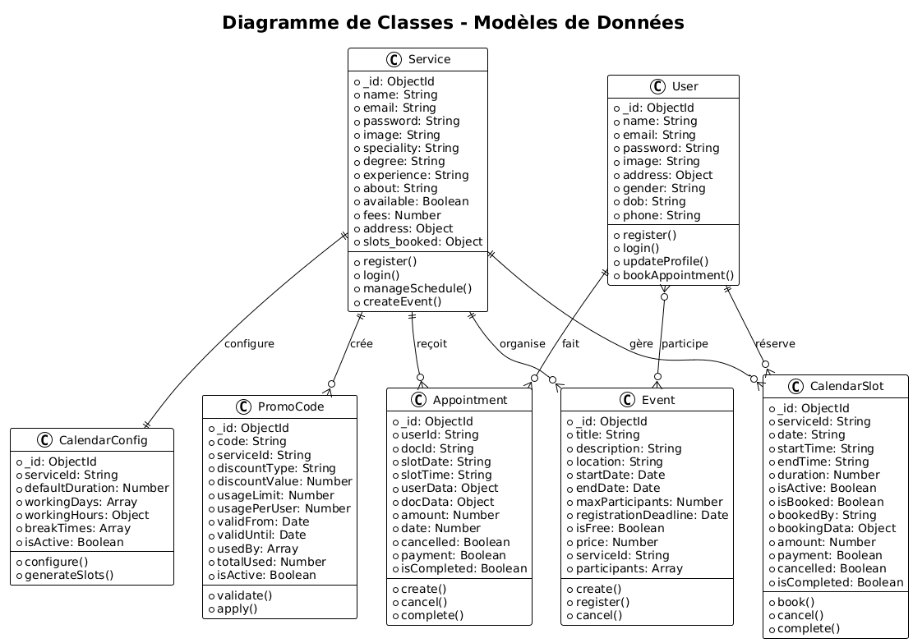

</div>

### Collections MongoDB

| Collection | Champs Cles |
|---|---|
| **users** | name, email, password (hashed), image, address, gender, dob, phone |
| **services** | name, email, speciality, degree, experience, fees, slots_booked, available |
| **appointments** | userId, docId, slotDate, slotTime, amount, payment, cancelled, isCompleted |
| **events** | title, description, location, startDate, endDate, maxParticipants, isFree, price, participants[] |
| **calendarSlots** | serviceId, date, startTime, endTime, duration, isBooked, bookedBy, amount, payment |
| **promoCodes** | code, serviceId, discountType, discountValue, usageLimit, validFrom, validUntil, usedBy[] |
| **calendarConfigs** | serviceId, defaultDuration, workingDays, workingHours, breakTimes |

---

## Cas d Utilisation

<div align="center">

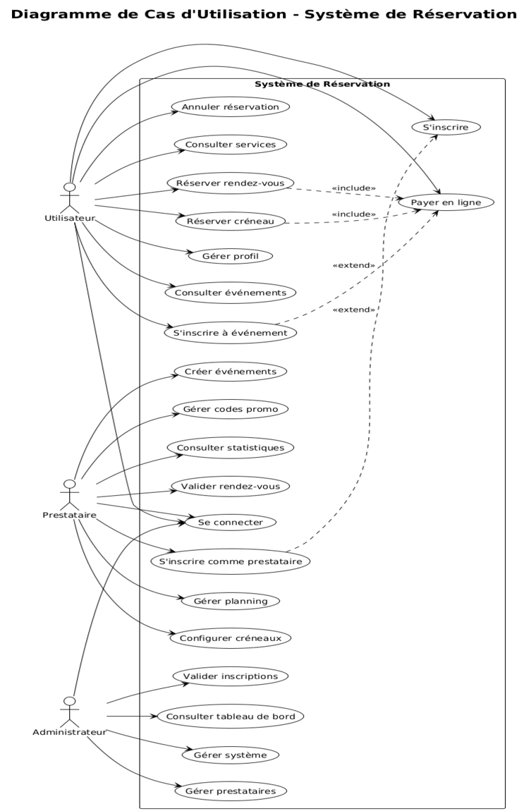

</div>

Trois acteurs principaux interagissent avec le systeme :

| Acteur | Cas d utilisation principaux |
|---|---|
| Utilisateur | S inscrire, Reserver rendez-vous, Reserver creneau calendrier, S inscrire a un evenement, Payer en ligne, Gerer profil |
| Prestataire | S inscrire comme prestataire, Configurer planning, Gerer evenements, Creer codes promo, Valider rendez-vous |
| Administrateur | Gerer prestataires, Consulter tableau de bord, Voir tous les rendez-vous |

---

## API REST Endpoints

<div align="center">

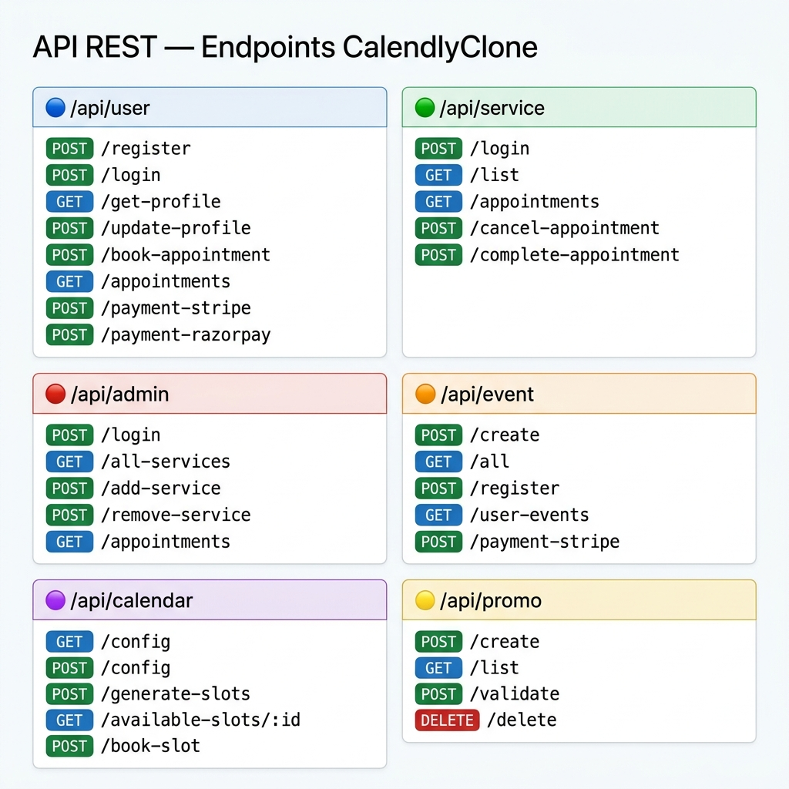

</div>

### /api/user — Utilisateurs

| Methode | Route | Auth | Description |
|---|---|---|---|
| POST | /register | — | Inscription utilisateur |
| POST | /login | — | Connexion utilisateur |
| GET | /get-profile | JWT | Recuperer profil |
| POST | /update-profile | JWT | Modifier profil + photo |
| POST | /book-appointment | JWT | Reserver rendez-vous |
| GET | /appointments | JWT | Lister mes rendez-vous |
| POST | /cancel-appointment | JWT | Annuler un rendez-vous |
| POST | /payment-stripe | JWT | Initier paiement Stripe |
| POST | /verifyStripe | JWT | Verifier paiement Stripe |
| POST | /payment-razorpay | JWT | Initier paiement Razorpay |
| POST | /verifyRazorpay | JWT | Verifier paiement Razorpay |
| POST | /payment-payzone | JWT | Initier paiement Payzone |
| POST | /calendar-payment-stripe | JWT | Paiement calendrier Stripe |
| POST | /calendar-payment-razorpay | JWT | Paiement calendrier Razorpay |

### /api/service — Prestataires

| Methode | Route | Auth | Description |
|---|---|---|---|
| POST | /login | — | Connexion prestataire |
| GET | /list | — | Liste des prestataires |
| GET | /appointments | JWT | Mes rendez-vous |
| POST | /cancel-appointment | JWT | Annuler rendez-vous |
| POST | /complete-appointment | JWT | Marquer complete |

### /api/admin — Administration

| Methode | Route | Auth | Description |
|---|---|---|---|
| POST | /login | — | Connexion admin |
| POST | /add-service | JWT Admin | Ajouter prestataire |
| GET | /all-services | JWT Admin | Tous les prestataires |
| POST | /remove-service | JWT Admin | Supprimer prestataire |
| GET | /appointments | JWT Admin | Tous les rendez-vous |

### /api/event — Evenements

| Methode | Route | Auth | Description |
|---|---|---|---|
| POST | /create | JWT Service | Creer evenement |
| GET | /all | — | Tous les evenements |
| POST | /register | JWT User | S inscrire a un evenement |
| GET | /user-events | JWT User | Mes evenements |
| PUT | /update/:eventId | JWT Service | Modifier evenement |
| DELETE | /delete/:eventId | JWT Service | Supprimer evenement |
| POST | /payment-stripe | JWT User | Paiement evenement |

### /api/calendar — Calendrier

| Methode | Route | Auth | Description |
|---|---|---|---|
| GET | /config | JWT Service | Obtenir configuration |
| POST | /config | JWT Service | Mettre a jour config |
| POST | /generate-slots | JWT Service | Generer creneaux |
| GET | /service-slots | JWT Service | Voir mes creneaux |
| POST | /toggle-slot | JWT Service | Activer/desactiver creneau |
| GET | /available-slots/:serviceId | — | Creneaux disponibles |
| POST | /book-slot | JWT User | Reserver creneau |
| POST | /cancel-booking | JWT User | Annuler reservation |
| GET | /user-bookings | JWT User | Mes reservations calendrier |

### /api/promo — Codes Promotionnels

| Methode | Route | Auth | Description |
|---|---|---|---|
| POST | /create | JWT Service | Creer code promo |
| GET | /list | JWT Service | Mes codes promo |
| POST | /validate | JWT User | Valider un code |
| DELETE | /delete | JWT Service | Supprimer un code |

---

## Diagrammes de Sequence

### Reservation de Rendez-vous

<div align="center">

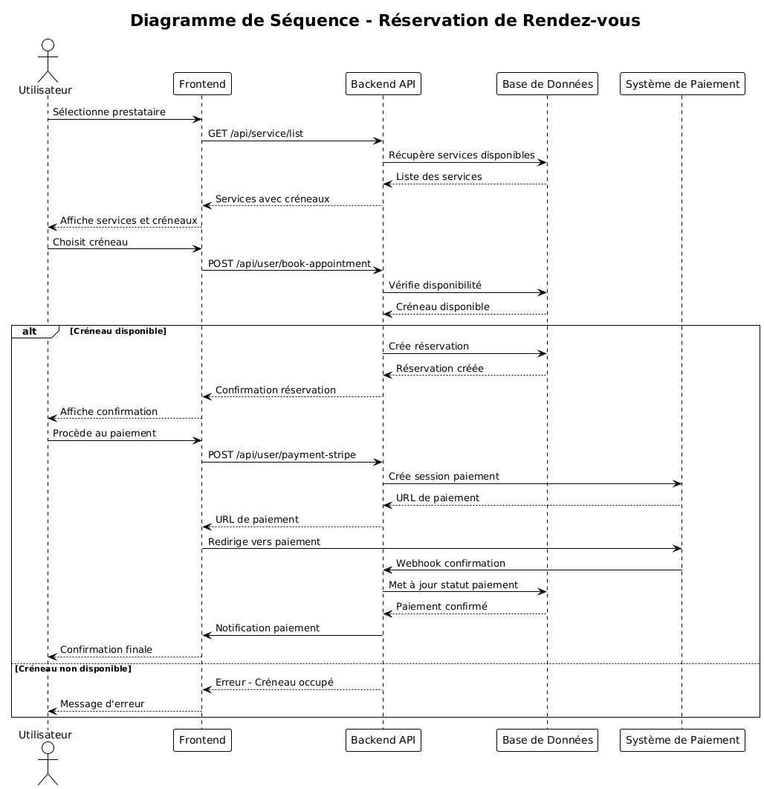

</div>

### Inscription Prestataire

<div align="center">

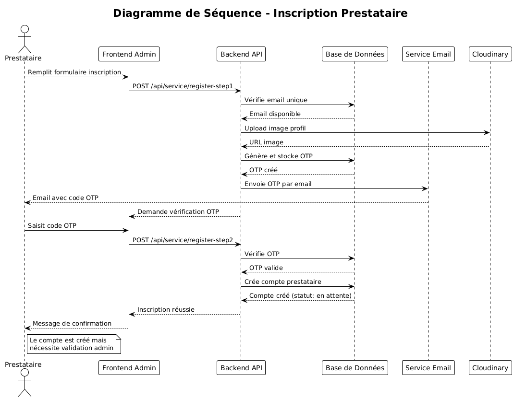

</div>

---

## Flux de Paiement Multi-Gateway

Le systeme supporte **3 passerelles de paiement** de maniere interchangeable :

```
Utilisateur selectionne le paiement
            |
    +-------+--------+
    v       v        v
 Stripe  Razorpay  Payzone
    |       |        |
    v       v        v
Session  Order    Lien paiement
    |       |        |
    +-------+--------+
            v
    Webhook / Verification
            |
    Mise a jour Base de Donnees
            |
    Email de Confirmation
```

**Codes promotionnels** : Avant le paiement, l utilisateur peut saisir un code promo qui applique une remise **fixe** (ex: -50 MAD) ou **en pourcentage** (ex: -20%), dans la limite des conditions definies par le prestataire.

---

## Diagrammes UML Supplementaires

### Diagramme d Activite

<div align="center">

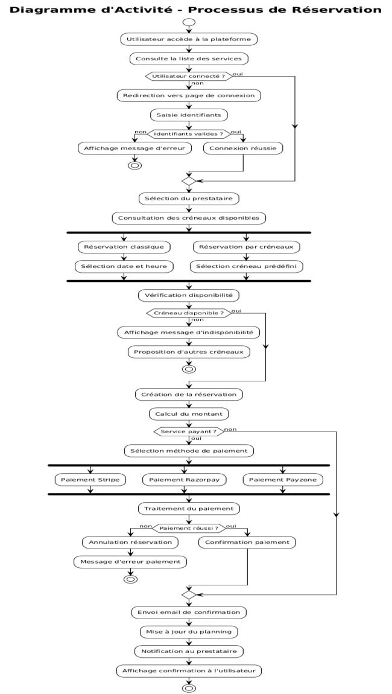

</div>

### Diagramme d Etats

<div align="center">

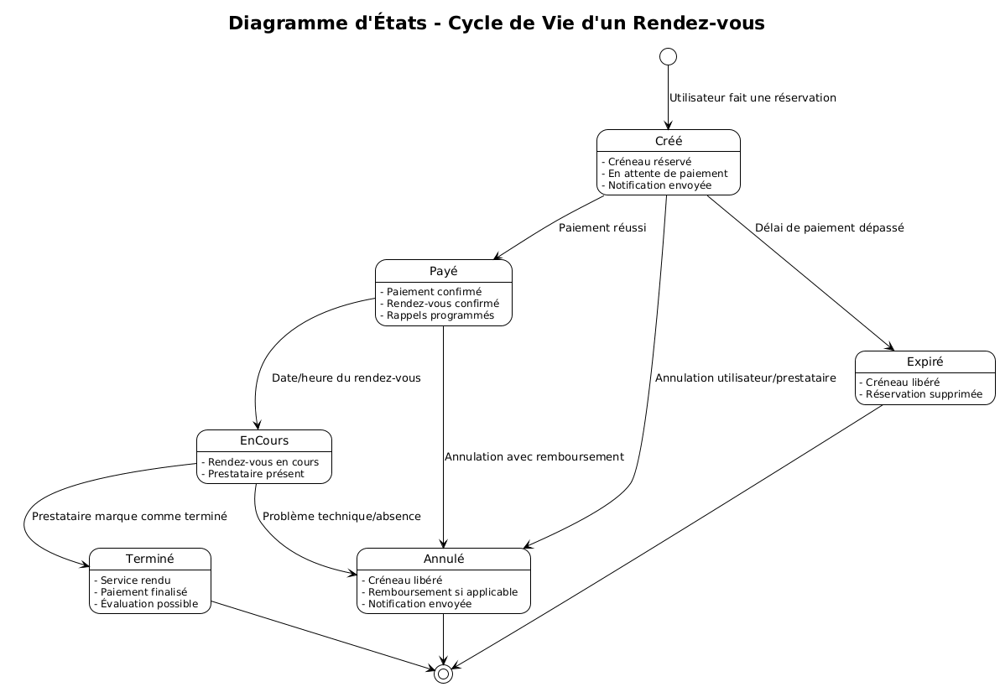

</div>

### Parcours Utilisateur

<div align="center">

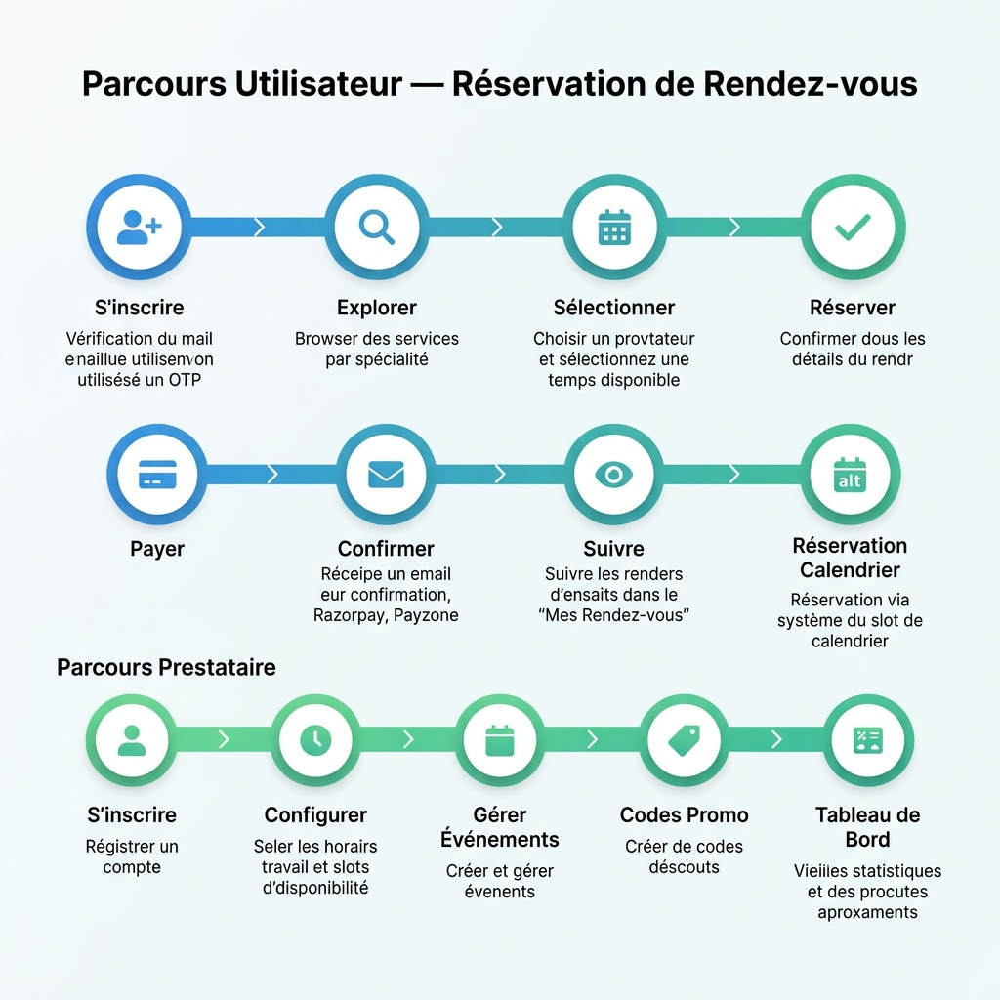

</div>

---

## Structure du Projet

```
Appointment_Booking_System/
|
+-- frontend/                    # Application utilisateur (React + Vite)
|   +-- src/
|       +-- pages/
|       |   +-- Home.jsx            # Page d accueil
|       |   +-- Services.jsx        # Exploration des prestataires
|       |   +-- Appointment.jsx     # Page de reservation
|       |   +-- MyAppointments.jsx  # Mes rendez-vous
|       |   +-- Events.jsx          # Liste des evenements
|       |   +-- EventRegister.jsx   # Inscription a un evenement
|       |   +-- MyEvents.jsx        # Mes evenements
|       |   +-- CalendarBooking.jsx # Reservation par calendrier
|       |   +-- MyCalendarBookings.jsx  # Mes reservations calendrier
|       |   +-- Meet.jsx            # Page de reunion
|       |   +-- MyProfile.jsx       # Profil utilisateur
|       |   +-- Login.jsx           # Connexion / Inscription
|       |   +-- VerifyPayment.jsx   # Verification paiement RDV
|       |   +-- VerifyEventPayment.jsx  # Verification paiement evenement
|       |   +-- VerifyCalendarPayment.jsx # Verification paiement calendrier
|       +-- components/
|           +-- Navbar.jsx          # Navigation
|           +-- Footer.jsx          # Pied de page
|           +-- Banner.jsx          # Banniere promotionnelle
|           +-- TopServices.jsx     # Meilleurs prestataires
|           +-- SpecialityMenu.jsx  # Menu par specialite
|           +-- RelatedServices.jsx # Prestataires similaires
|
+-- admin/                       # Panel admin + prestataire (React + Vite)
|   +-- src/
|       +-- pages/
|           +-- Login.jsx           # Connexion admin / prestataire
|           +-- Admin/
|           |   +-- Dashboard.jsx   # Tableau de bord
|           |   +-- AllApointments.jsx # Tous les rendez-vous
|           |   +-- ServiceList.jsx # Liste prestataires
|           |   +-- AddService.jsx  # Ajouter prestataire
|           +-- Service/            # Interface prestataire
|
+-- backend/                     # API REST (Node.js + Express)
|   +-- server.js                   # Point d entree
|   +-- config/
|   |   +-- mongodb.js              # Connexion MongoDB
|   |   +-- cloudinary.js           # Config Cloudinary
|   +-- models/
|   |   +-- userModel.js            # Schema utilisateur
|   |   +-- serviceModel.js         # Schema prestataire
|   |   +-- appointmentModel.js     # Schema rendez-vous
|   |   +-- eventModel.js           # Schema evenement
|   |   +-- calendarSlotModel.js    # Schema creneau calendrier
|   |   +-- promoCodeModel.js       # Schema code promo
|   |   +-- calendarConfigModel.js  # Schema config calendrier
|   +-- controllers/
|   |   +-- userController.js       # Logique utilisateur + paiements
|   |   +-- serviceController.js    # Logique prestataire
|   |   +-- adminController.js      # Logique administration
|   |   +-- eventController.js      # Logique evenements
|   |   +-- calendarController.js   # Logique calendrier
|   |   +-- promoCodeController.js  # Logique codes promo
|   +-- routes/
|   |   +-- userRoute.js
|   |   +-- serviceRoute.js
|   |   +-- adminRoute.js
|   |   +-- eventRoute.js
|   |   +-- calendarRoute.js
|   |   +-- promoCodeRoute.js
|   +-- middlewares/
|       +-- authUser.js             # Middleware JWT utilisateur
|       +-- authService.js          # Middleware JWT prestataire
|       +-- authAdmin.js            # Middleware JWT admin
|       +-- multer.js               # Upload fichiers
|
+-- md-assets/                   # Assets de documentation
```

---

## Installation et Lancement

### Prerequis

- Node.js v18+
- Compte MongoDB Atlas
- Compte Cloudinary
- Cles API Stripe / Razorpay

### Backend

```bash
cd backend
npm install
# Configurer le fichier .env
npm run server
# Serveur demarre sur http://localhost:4000
```

### Frontend Utilisateur

```bash
cd frontend
npm install
# VITE_BACKEND_URL=https://calendlyclone-back.vercel.app
npm run dev
# Accessible sur http://localhost:5173
```

### Admin / Prestataire

```bash
cd admin
npm install
# VITE_BACKEND_URL=https://calendlyclone-back.vercel.app
npm run dev
# Accessible sur http://localhost:5174
```

---

## 

<div align="center">

**Zakaria Ennaqui**

*Etudiant en Genie Informatique — ENSA Berrechid*

*Stage d initiation chez **Xperlik** — 2025*

[](https://www.linkedin.com/in/zakaria-ennaqui-990883362)
[](https://github.com/zakariaennaqui)
[](https://zakaria-ennaqui.vercel.app)

</div>

---

<div align="center">

*Developpe avec ❤️ lors d un stage d initiation chez Xperlik — 2025*

</div>
